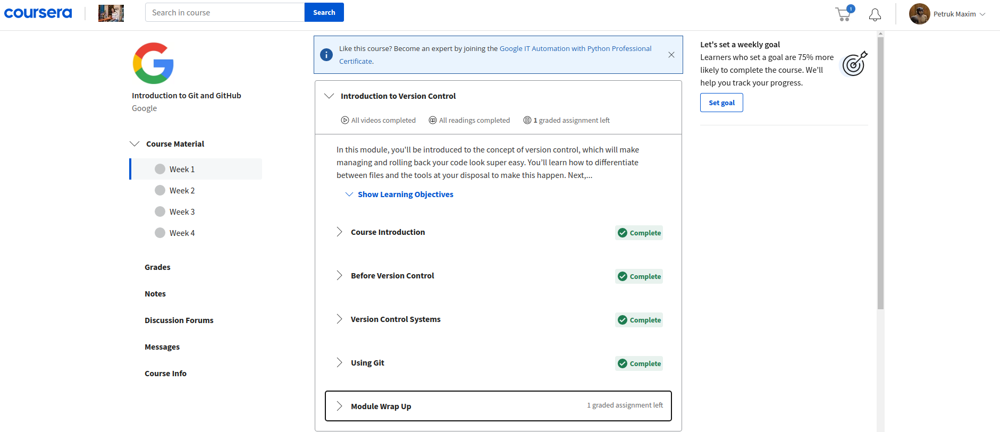
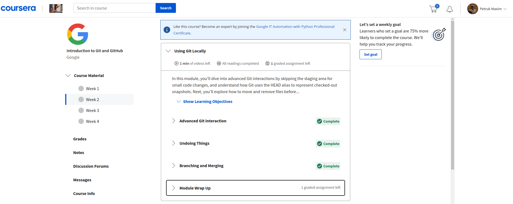
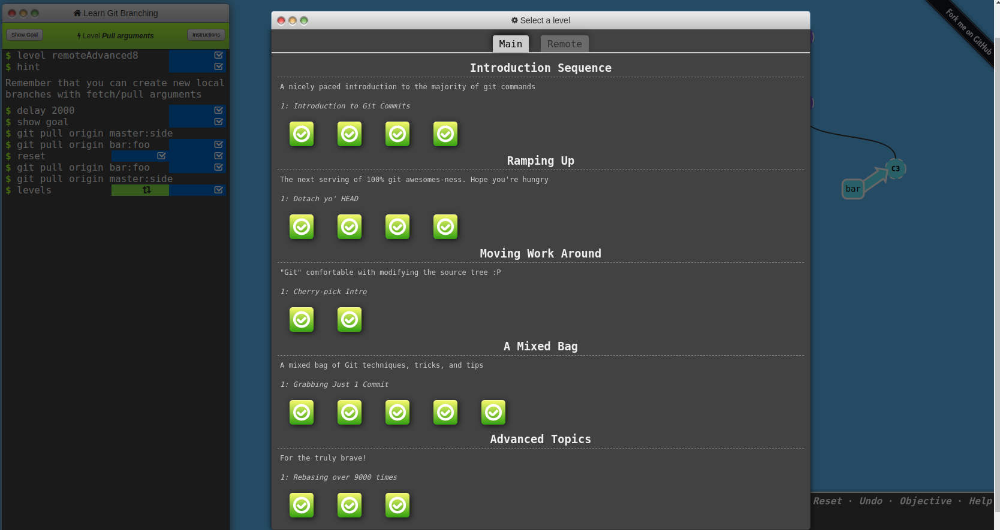
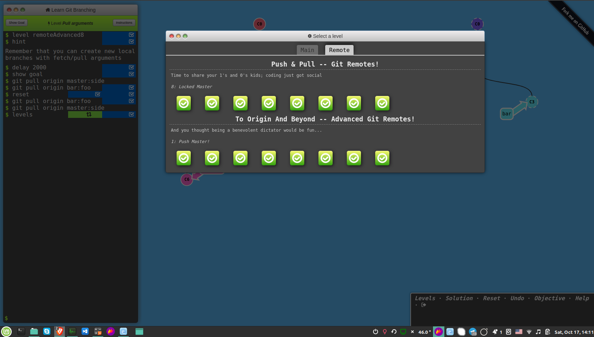
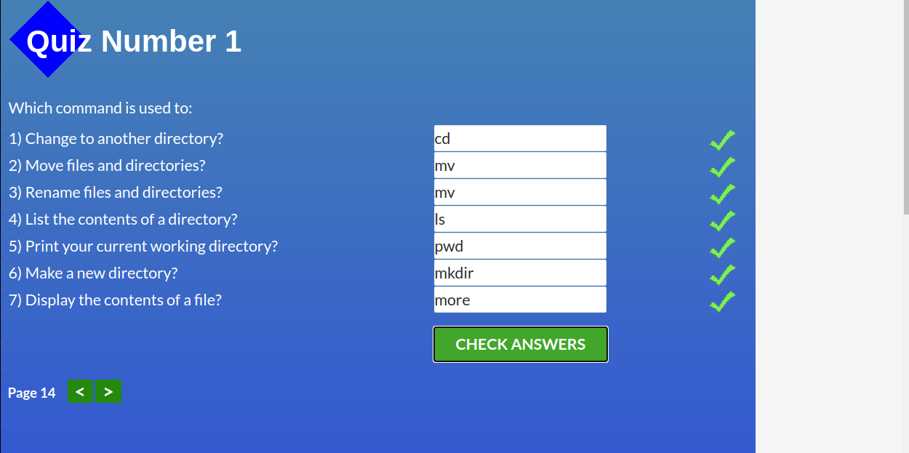
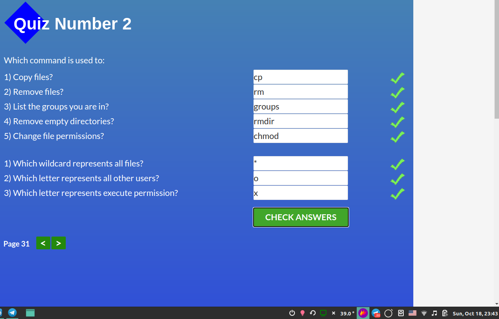
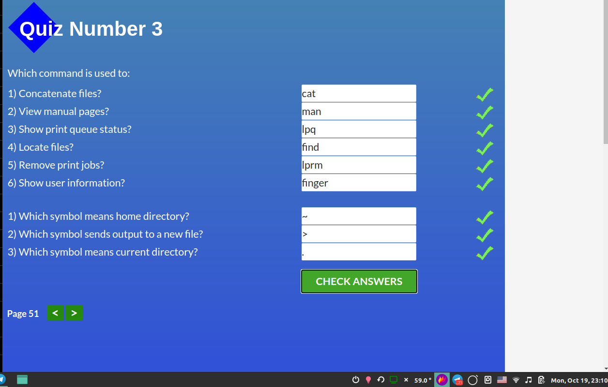
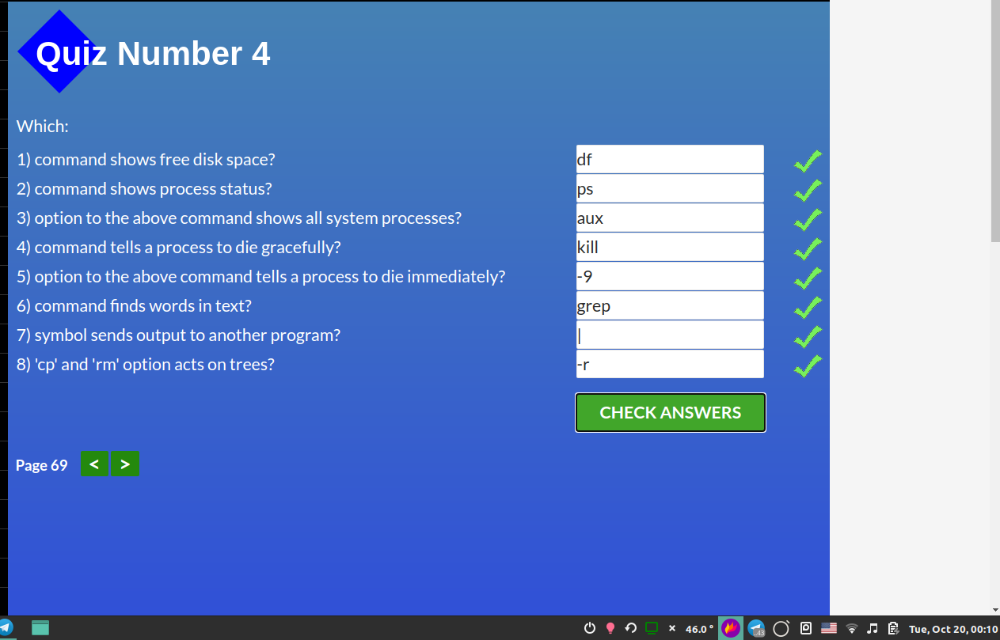

# Front-End Course from gorgeous [Kottans](https://kottans.org/)

## The repository is dedicated to taking part in [Kottans frontend course](https://github.com/kottans/frontend)

### What I have done so far :rocket:

 1. **General**
    - [x] [Git Basics](#0-git-basics)
    - [x] [Linux CLI and Networking](#1-linux-cli-and-networking)
    - [ ] [VCS (hello gitty), GitHub and Collaboration](#2-vcs-hello-gitty-github-and-collaboration)
  
 2. **Front-End Basics**

    - [ ] [Intro to HTML & CSS](#3-intro-to-html-and-css)
    - [ ] [Responsive Web Design](#5-responsive-web-design)
    - [ ] [HTML & CSS Practice](#6-html-css-practice)
    - [ ] [JavaScript Basics](#7-javascript-basics)
    - [ ] [Document Object Model - practice](#8-document-object-model-practice)
  
 3. **Advanced Topics**

    - [ ] [Building a Tiny JS World (pre-OOP) - practice](#9-building-a-tiny-js-world-pre-oop-practice)
    - [ ] [Object oriented JS - practice](#10-object-oriented-js-practice)
    - [ ] [OOP exercise - practice](#11-oop-exercise-practice)
    - [ ] [Offline Web Applications](#12-offline-web-applications)
    - [ ] [Memory pair game — real project!](#13-memory-pair-game-real-project)
    - [ ] [Website Performance Optimization](#14-website-performance-optimization)
    - [ ] [Friends App - real project!](#15-friends-app-real-project)

    ## General

### 0. Git Basics
***
[Version Control with Git](https://www.coursera.org/learn/introduction-git-github)
    
  

Screenshot

  

  
  

  

  

    
[Learn Git Branching](https://learngitbranching.js.org/)

  

Screenshots

  

  
  

  

  

 
 I already took the courses in the past. Still, it was worth refreshing my knowledge of Git and Github.

 ### 1. Linux CLI and Networking
***
   #### 1.1 Course [Linux Survival (4 modules)](https://linuxsurvival.com/linux-tutorial-introduction/)

  

Screenshots

  

  
  
  
  

  

  

- **What was new:**
  

  

  - the "**more**" command which is used to view the contents of a file in your terminal.
  - the "**pwd**" command. I realized that once I used the command a few times but with the course of time it just slipped my mind.
  - *mv cats/tigers cats/siberians* - renaming the folder by specifying the pathname relative to the parent folder
  - *mv ../cats/tigers ../cats/siberians* - renaming the folder when you are in a neighboring folder 
  - *ls -l* - the command shows **more** info about files in a folder
  - ***chmod g+w chimps*** - the command changes the security permissions on files. In this case, it gives "write" permission to the group for file "chimps"
  - **wildcards (such as **ing*) are used to match a certain number of characters**
  - chmod g+w * - gives "write" permission to the group on all files in the current folder
  - **groups** - shows group memberships in the current folder
  - *cp ~/jokes /tmp* - copies a file called "jokes" from my home folder to the "/tmp" folder. The command is shorter than *cp /home/keeper/jokes /tmp*
  - **man** command
  - **finger** command - shows a user info. To use the command you need to install *finger* (sudo apt-get install finger)
  - **find ** command (e.g. find . -name "joke*") = to find files
  - **cat** command (e.g. cat joke-1 joke-2). The jokes are corny though :)
  - cat jabber wocky > poem - it puts the contents of the two files into a file called poem
  - lpr -P zephyr corny - where zephyr is the printer, corny is the file to print, lpr -P is the command to print
  - lprm -P zephyr 737 - removes a print job 737
  - cp -r ~jester/jokes ~  = cp -r lets you copy folders
  - df = shows how much disk space you have left on your system
  - df ~ = shows the statistics for the disk where your home folder resides
  - rm -r stocks = removes everything in "stocks" folder
  - ps aux = shows a detailed list of all processes
  - "|" - (to pipe) it sends the output of a command as the input to another command
  - cat joke-1 joke-2 | grep rabbit
  - ps aux | grep rogue = the command sequence that lists only those processes which contain the word "rogue"
  - kill PID = kills a process where PID is the id of the process
  - kill -9 PID = kills a process at once

  

  

- **What surprised me:**

  - I learned about squirrel monkeys. They look extremely cute :)

- **What I intend to use in the future**
  - I would say I am going to use most of the commands but for the commands related to printing

#### 1.2 Article [HTTP: The Protocol Every Web Developer Must Know - Part 1](https://code.tutsplus.com/tutorials/http-the-protocol-every-web-developer-must-know-part-1--net-31177)

- **What was new:**

  - every request is completely independent, it's stateless

  - additional request verbs which are less common (e.g. HEAD, TRACE, OPTIONS)
  - such utilities as **curl**, **tcpbump** and **tsshark** are used for monitoring HTTP traffic.

- **What surprised me:**

  - Finally I learned what URL stands for :), which is "Uniform Resource Locators"

- **What I intend to use in the future:**

  - To my mind, as a developer, I have to know how to work with what Developer Tools show, that is to say, the output of headers and status codes.

- **General Overview:**

  There was so much new stuff in the article to get my head around so I feel a bit overwhelmed now. It's important to know the theory but I have a feeling like I need to see how the knowledge of the protocol and its codes is applied on a practical level.

#### 1.3 Article [HTTP: The Protocol Every Web Developer Must Know - Part 2](https://code.tutsplus.com/tutorials/http-the-protocol-every-web-developer-must-know-part-2--net-31155)

- **What was new:**

  - such things as *persistent connections*, *parallel connections,* 

  - HTTP supports Basic Authentication and Digest Authentication which is more secure.
  - Due its simplicity Basic Authentication is more common than Digest A. 
  - I'd say - quite many things were new to me

- **What I intend to use in the future:**

  - I figure a lot of it. 

- **General Overview:**

  I feel like I need to put it into practice and deep dive into it to fully grasp it.