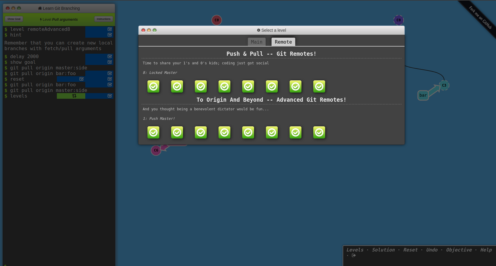

# Front-End Course from gorgeous [Kottans](https://kottans.org/)

## The repository is dedicated to taking part in [Kottans frontend course](https://github.com/kottans/frontend)

### What I have done so far :rocket:

 1. **General**
    - [x] [Git Basics](#0-git-basics)
    - [ ] [Linux CLI and Networking](#1-linux-cli-and-networking)
    - [ ] [VCS (hello gitty), GitHub and Collaboration](#2-vcs-hello-gitty-github-and-collaboration)
  
 2. **Front-End Basics**

    - [ ] [Intro to HTML & CSS](#3-intro-to-html-and-css)
    - [ ] [Responsive Web Design](#5-responsive-web-design)
    - [ ] [HTML & CSS Practice](#6-html-css-practice)
    - [ ] [JavaScript Basics](#7-javascript-basics)
    - [ ] [Document Object Model - practice](#8-document-object-model-practice)
  
 3. **Advanced Topics**

    - [ ] [Building a Tiny JS World (pre-OOP) - practice](#9-building-a-tiny-js-world-pre-oop-practice)
    - [ ] [Object oriented JS - practice](#10-object-oriented-js-practice)
    - [ ] [OOP exercise - practice](#11-oop-exercise-practice)
    - [ ] [Offline Web Applications](#12-offline-web-applications)
    - [ ] [Memory pair game — real project!](#13-memory-pair-game-real-project)
    - [ ] [Website Performance Optimization](#14-website-performance-optimization)
    - [ ] [Friends App - real project!](#15-friends-app-real-project)

    ## General

### 0. Git Basics
***
[Version Control with Git](https://www.coursera.org/learn/introduction-git-github)
    
  

Screenshot

  

  
  

  

  

    
[Learn Git Branching](https://learngitbranching.js.org/)

  

Screenshots

  

  
  

  

  

 
 I already took the courses in the past. Still, it was worth refreshing my knowledge of Git and Github.
